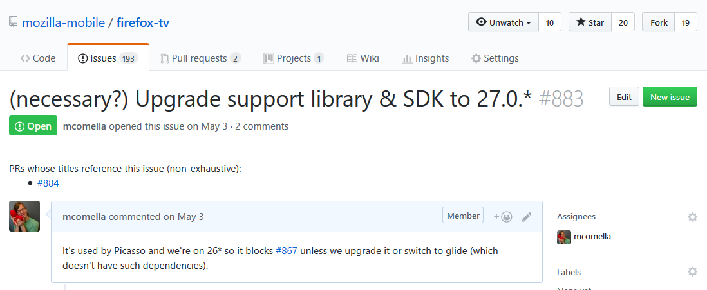

# GitHub Issue PR Linker
[Available on addons.mozilla.org][AMO]

An add-on that inserts one-click links from GitHub issue to PRs and vice versa:



For an overview of how it works, see [the docs.][docs]

### Alternatives
[GitHub Issue Hoister][hoister]: this web browser add-on copies links to the top of the page that eventually link from an issue to PR and vice versa. For example, GitHub provides links in their issues such as "mcomella added a commit that referenced this issue". This link will link to a commit that, if part of a PR, will link to the PR associated with the issue.

The Issue PR Linker is simpler -- it just works and takes a single click to go from issue to PR -- but is less frequently updated and operates on a subset of PRs (due to rate limits). The Issue Hoister is more complex but is more up-to-date.

## Development
Install the typescript compiler (through `npm`) and run with:
```sh
tsc
```

The options menu uses a separate compile target so if you're modifying `options.ts`:
```sh
tsc -p src/options
```

In Firefox, you can load [a temporary add-on][temp addon] for testing.
Add the `-w` argument for continuous compilation.

Development with Visual Studio Code is recommended, given its awareness of Typescript types.

### Tests
Build and run the tests:
```sh
tsc -p spec && jasmine
```

## Publishing
`out/bundle.xpi` will be created after:
```sh
./publish.sh
```

## License
Typescript type definitions (`typings/`) are available [via
DefinitelyTyped][typed] under the MIT license. The license file is included in that directory.

The license included with this repository is based on the X11 license, which is similar to the MIT license.

[docs]: https://github.com/mcomella/github-issue-pr-linker/blob/master/docs/README.md
[AMO]: https://addons.mozilla.org/en-US/firefox/addon/github-issue-pr-linker/
[hoister]: https://github.com/mcomella/github-issue-hoister
[typed]: https://github.com/DefinitelyTyped/DefinitelyTyped
[temp addon]: https://developer.mozilla.org/en-US/docs/Tools/about:debugging#Enabling_add-on_debugging
